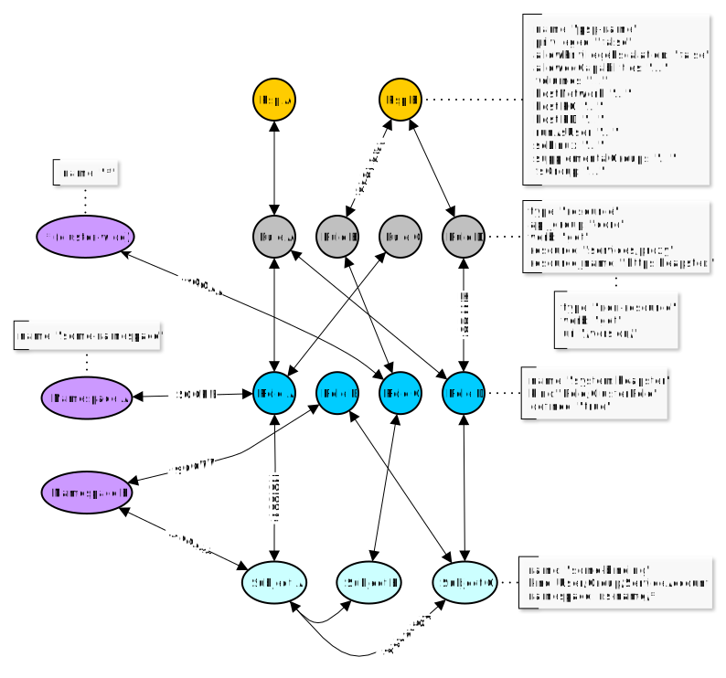

# Krane

> Kubernetes RBAC Analysis made Easy


Krane is a simple Kubernetes RBAC static analysis tool. It identifies potential security risks in K8s RBAC design and makes suggestions on how to mitigate them. Krane dashboard presents current RBAC security posture and lets you navigate through its definition.

## Features

- **RBAC Risk rules** - _Krane_ evaluates a set of built-in RBAC risk rules. These can be modified or extended with a set of custom rules.
- **Portability** - _Krane_ can run in one of the following modes:
  * Locally as a CLI or docker container.
  * In CI/CD pipelines as a step action detecting potential RBAC flaws before it gets applied to the cluster.
  * As a standalone service continuously analysing state of RBAC within a Kubernetes cluster.
- **Reporting** - _Krane_ produces easy to understand RBAC risk report in machine-readable format.
- **Dashboard** - _Krane_ comes with a simple Dashboard UI helping you understand in-cluster RBAC design. Dashboard presents high-level overview of RBAC security posture and highlights detected risks. It also allows for further RBAC controls inspection via faceted tree and graph network views.
- **Alerting** - It will alert and notify about detected medium and high severity risks via its Slack integration.
- **RBAC in the Graph** - _Krane_ indexes entirety of Kubernets RBAC in a local Graph database which makes any further ad-hoc interrogating of RBAC information easy, with arbitrary CypherQL queries.

## Contents short

- [Local Quick Start](#local-quick-start)
- [Usage Guide](#usage-guide)
- [Architecture](#architecture)
- [Kubernetes Deployment](#kubernetes-deployment)
- [Notifications](#notifications)
- [Local Development](#local-development)
- [Contributing to Krane](#contributing-to-krane)
- [Community](#community)
- [Roadmap](#roadmap)
- [License](#license)

## Local Quick Start

Get started locally with Docker Compose.

### Pre-requisites

It is assumed that you have [docker](https://docs.docker.com/get-docker/) running on your local machine. Install [docker-compose](https://docs.docker.com/compose/install/#install-compose) if you haven't already.

### Run Krane locally

Krane depends on RedisGraph. `docker-compose` stack defines all what's required to build and run _Krane_ service locally. It'll also take care of its [RedisGraph](https://oss.redislabs.com/redisgraph/) dependency.

```
docker-compose up -d
```

_Krane_ docker image will be pre-build automatically if not already present.

Note that when running `docker-compose` locally, _Krane_ won't start RBAC _report_ and _dashboard_ automatically. Instead, the container will sleep (for 24h by default - this value can be adjusted in docker-compose.override.yml). Exec into a running _Krane_ container to run commands. Local `docker-compose` will also mount kube config (`~/.kube/config`) inside the container so you can run reports against any Kubernetes clusters to which you already have access to.

```
# Exec into a running Krane container

docker-compose exec krane bash

# Once in the container you can start using `krane` commands. Try `krane -help`.

$ krane -h
```

To inspect what services are running and see associated ports:
```
docker-compose ps
```

To stop _Krane_ and its dependecy services:
```
docker-compose down
```

## Usage Guide

### Commands

```
$ krane --help

  NAME:

    krane

  DESCRIPTION:

    Kubernetes RBAC static analysis & visualisation tool

  COMMANDS:

    dashboard Start K8s RBAC dashboard server
    help      Display global or [command] help documentation
    report    Run K8s RBAC report

  GLOBAL OPTIONS:

    -h, --help
        Display help documentation

    -v, --version
        Display version information

    -t, --trace
        Display backtrace when an error occurs

  AUTHOR:

    Marcin Ciszak <marcin.ciszak@appvia.io> - Appvia Ltd <appvia.io>
```

### Generate RBAC report

#### With local `kubectl` context

To run a report against a running cluster you must provide a _kubectl_ context
```
krane report -k <context>
```

You may also pass `-c <cluster-name>` flag if you plan to run the tool against multiple different clusters and index RBAC graph separately for each cluster name.

#### From RBAC files stored in directory

To run a report against local RBAC yaml/json files, provide a directory path
```
krane report -d </path/to/rbac-directory>
```
NOTE: _Krane_ expects the following files (in either YAML or JSON format) to be present in provided directory path:
  - psp
  - roles
  - clusterroles
  - rolebindings
  - clusterrolebindings

#### Inside a Kubernetes cluster

To run report in-cluster
```
krane report --incluster
```
NOTE: Service account used by _Krane_ will require access to RBAC resources. See required [RBAC](k8s/one-time/rbac.yaml).

#### In CI/CD pipeline

To validate RBAC definition as step in CI/CD pipeline
```
krane report --ci -d </path/to/rbac-directory>
```
NOTE: _Krane_ expects certain naming convention to be followed for locally stored RBAC resource files. See [section](#from-rbac-files-stored-in-the-filesystem) above. In order to run `krane` command it's recommended that CI executor references [quay.io/appvia/krane:latest](https://quay.io/repository/appvia/krane?tab=tags) docker image.

### Visualisation Dashboard

To view RBAC facets tree, network graph and latest report findings you need to start dashboard server first.
```
krane dashboard
```

Cluster flag `-c <cluster-name>` may be passed if you want to run the dashboard against specific cluster name. Dashboard will look for data related to specified cluster name which is cached on the file system.

Command above will start local web server on default port 8000, and display the dashboard link.

## Architecture

### RBAC Data indexed in a local Graph database

_Krane_ indexes RBAC entites in RedisGraph. This allows us to query network of dependencies efficiently and simply using subset of [CypherQL](https://oss.redislabs.com/redisgraph/cypher_support/) supported by [RedisGraph](https://oss.redislabs.com/redisgraph/).

#### Schema



#### Nodes

The following nodes are created in the Graph for the relevant RBAC objects:

* `Psp`       - A PSP node containing attributes around the pod security policy.
* `Rule`      - Rule node represents access control rule around Kubernetes resources.
* `Role`      - Role node represents a given Role or ClusterRole. `kind` attribute defines type of role.
* `Subject`   - Subject represents all possible actors in the cluster (`kind`: User, Group and ServiceAccount)
* `Namespace` - Kubernetes Namespace node.

#### Edges

* `:SECURITY`  - Defines a link between a Rule and a Psp nodes.
* `:GRANT`     - Defines a link between a Role and a Rule associated with that role.
* `:ASSIGN`    - Defines a link between an Actor (Subject) and given Role/ClusterRole (Role node).
* `:RELATION`  - Defines a link between two different Actor (Subject) nodes.
* `:SCOPE`     - Defines a link between a Role and a Namespace nodes.
* `:ACCESS`    - Defines a link between a Subject and a Namespace nodes.
* `:AGGREGATE` - Defines a link between ClusterRoles (one ClusterRole aggregates another) `A-(aggregates)->B`
* `:COMPOSITE` - Defines a link between ClusterRoles (one ClusterRole can be aggregated in another) `A<-(is a composite of)-B`

All edges are bidirectional, which means graph can be queried in either direction.
Only exceptions are `:AGGREGATE` and `:COMPOSITE` relations which are uni-directional, though concerned with the same edge nodes.

#### Querying the Graph

In order to query the graph directly you can exec into a running `redisgraph` container, start `redis-cli` and run your arbitrary queries. Follow official [instructions](https://oss.redislabs.com/redisgraph/) for examples of [commands](https://oss.redislabs.com/redisgraph/commands/).

You can also query the Graph from _Krane_ console. First exec into running _Krane_ container, then

```
# Start Krane console - this will open interactive ruby shell with Krane code preloaded

console

# Instantiate Graph client

graph = Krane::Clients::RedisGraph.client cluster: 'default'

# Run arbitrary CypherQL query against indexed RBAC Graph

res = graph.query(%Q(
  MATCH (r:Rule {resource: "configmaps", verb: "update"})<-[:GRANT]-(ro:Role)<-[:ASSIGN]-(s:Subject)
  RETURN s.kind as subject_kind, s.name as subject_name, ro.kind as role_kind, ro.name as role_name))

# Print the results

res.print_resultset

# Results...
+----------------+--------------------------------+-----------+------------------------------------------------+
| subject_kind   | subject_name                   | role_kind | role_name                                      |
+----------------+--------------------------------+-----------+------------------------------------------------+
| ServiceAccount | bootstrap-signer               | Role      | system:controller:bootstrap-signer             |
| User           | system:kube-controller-manager | Role      | system::leader-locking-kube-controller-manager |
| ServiceAccount | kube-controller-manager        | Role      | system::leader-locking-kube-controller-manager |
| User           | system:kube-scheduler          | Role      | system::leader-locking-kube-scheduler          |
| ServiceAccount | kube-scheduler                 | Role      | system::leader-locking-kube-scheduler          |
+----------------+--------------------------------+-----------+------------------------------------------------+
```

Note: Example query above will select all Subjects with Roles/ClusterRoles granting access to `update configmaps`.

## Configuration

### RBAC Risk Rules

RBAC risk rules are defined in the [Rules](config/rules.yaml) file. The structure of each rule is largely self-explanatory.
Built-in set can be expanded / overridden by adding extra custom rules to the [Cutom Rules](config/custom-rules.yaml) file.

#### Risk Rule Macros

Macros are a set of common/shared attributes referenced by one or more risk rules. If you choose to use macro in a given risk rule you need to reference it with its name, e.g. `macro: <macro-name>`. Note that attributes defined in referenced `macro` will take precedence over the same attributes defined on the rule level.

Macro can contain any of the following attributes:

- `query`    [RedisGraph query](#querying-the-graph). Has precedence over `template`. Requires `writer` to be defined.
- `writer`   Writer is a Ruby expression used to format `query` result set. Writer has precedence over `template`.
- `template` Built-in query/writer template name. If `query` & `writer` are not specified then chosen
            query generator will be used along with matching writer.

#### Risk Rule attributes

Rule can contain any of the following attributes:

- `id`           [Required] Rule id should be a unique identifier.
- `group_title`  [Required] Title applying to all items falling under this risk check.
- `severity`     [Required] Severity, as one of :danger, :warning, :info.
- `info`         [Required] Textual information about the check and suggestions on how to mitigate the risk.
- `query`        [Conditonal] [RedisGraph query](#querying-the-graph).
  - Has precedence over `template`. Requires `writer` to be defined.
- `writer`       [Conditonal] Writer is a Ruby expression used to format query result set.
  - Writer has precedence over `template`. Requires `query` to be defined.
- `template`     [Conditonal] Built-in query/writer template name. If `query` & `writer` are not specified then chosen query generator will be used along with matching writer.
  - Some built-in templates require `match_rules` attribute to be specified on individual rule level in order to build correct query. Templates currently requiring it:

    - **_risky-role_** - Builds multi-match graph query based on the access rules specified by `match_rules`. Generated graph query returns the following columns:
      - role_name
      - role_kind
      - namespace_name (an array is returned if multiple items returned)

- `match_rules`  [Conditonal] Required when `template` relies on match rules in order to build a query.
  - Example:
    ```
     match_rules:
     - resources: ['cronjobs']
       verbs: ['update']
    ```
     Attributes and values follow [Kubernetes RBAC role specification](https://kubernetes.io/docs/reference/access-authn-authz/rbac/#role-examples).

- `custom_params` [Optional] List of custom key-value pairs to be evaluated and replaced in a rule `query` / `writer` representations.
  - Example:
    ```
    custom_params:
    - attrA: valueA
    - attrB: valueB
    ```
    Templated placeholders for the keys above `{{attrA}}` and `{{attrB}}` will be replaced with `valueA` and `valueB` respectively.

- `threshold`  [Optional] Numeric value. When definied this will become available as template placeholder `{{threshold}}` in the `writer` expression.
- `macro`      [Optional] Reference to common parameters set defined in a named macro.
- `disabled`   [Optional] When set to `true` it'll disable given rule and exclude it from evaluation.
                By default all rules are enabled.

#### Risk Rule examples

##### Explicit query / writer expression
```
- id: verbose-rule-example
  group_title: Example rule
  severity:    :danger
  info:        Risk description and instructions on how to mitigate it goes here
  query: |
    MATCH
      (s:Subject)-[:ACCESS]->(ns:Namespace)
    WHERE
      NOT s.name IN {{whitelist_subject_names}}
    RETURN
      s.kind as subject_kind,
      s.name as subject_name,
      COLLECT(ns.name) as namespace_names
    ORDER BY
      subject_kind,
      subject_name,
      namespace_names DESC
  threshold: 2
  writer: |
    if result.namespace_names.count > {{threshold}}
      "#{result.subject_kind} #{result.subject_name} can access namespaces: #{result.namespace_names.join(', ')}"
    end
  disabled: true
```

The example above explicitly defines a graph `query` which is used to evaluate RBAC risk, and a `writer` expression used to format query result set. The query simply selects all `Subjects` (excluding whitelisted) and `Namespaces` to which they have access to. Note that result set will only include `Subjects` having access to more than `2` Namespaces (Noticed `threshold` value there?). Last `writer`'s expression will be captured as formatted result item output.

`writer` can access the result set item via `result` object which has methods matching elements defined in query `RETURN` section, e.g. `result.subject_kind`, `result.subject_name` etc.

Note:
- `{{threshold}}` placeholder in the `writer` expression will be replaced by the rule's `threshold` keyword value.
- `{{whitelist_subject_names}}` represents custom field which will be interpolated with values defined in the [Whitelist](#rbac-risk-whitelist) for a given rule `id`. If a placeholder field name is not defined in the whitelist it'll be substituted with an empty array `['']` by default. Read more on whitelisting below.

##### Templated Risk Rule

Built-in templates simplify risk rule definition significantly, however, they are designed to extract specific kind of information and may not be a good fit for your custom rules. If you find yourself reusing the same `query` or `writer` expressions acros multiple rules, you should consider extracting those to a `macro` and reference it in your custom rules to DRY them up.

```
- id: risky-any-verb-secrets
  group_title: Risky Roles/ClustersRoles allowing all actions on secrets
  severity: :danger
  info: Roles/ClusterRoles allowing all actions on secrets. This might be dangerous. Review listed Roles!
  template: risky-role
  match_rules:
  - resources: ['secrets']
    verbs: ['*']
```

Example above shows one of the built-in rules. It references `risky-role` template which upon processing will expand the rule by injecting `query` and `writer` expressions before rule evalutation triggers. `match_rules` will be used to build appropriate match query.


### RBAC Risk Whitelist

Optional whitelist contains a set of custom defined attribute names and respective (whitelisted) values.

#### Whitelist attributes

Attribute names and their values are arbitrary. They are defined in the [Whitelist](config/whitelist.yaml) file and divided into three separate sections:
  - `global` - Top level scope. Custom attributes defined here will apply to all Risk Rules regardless of the cluster name.
  - `common` - Custom attributes will be scoped to specific Risk Rule `id` regardless of the cluster name.
  - `cluster` (with nested list of cluster names) - Custom attributes will apply to specific Risk Rule `id` for a given cluster name.


Each [Risk Rule](#rbac-risk-rules), upon evaluation, will attempt to interpolate all parameter placeholders used in the `query`, e.g. `{{your_whitelist_attribute_name}}`. If a placeholder parameter name (i.e. a name between the double curly brackets) matches any of the whitelisted attribute names for that Risk Rule `id`, it will be replaced with its calculated value.
If no values are found for a given placeholder, it'll be substituted with `['']`.

#### Whitelist examples

Example whitelist below produces the following `placeholder_key => value` mapping for a [Risk Rule](#rbac-risk-rules) with `id` attribute matching _"some-risk-rule-id"_
```
{{whitelist_role_names}}    => ['acp:prometheus:operator']
{{whitelist_subject_names}} => ['privileged-psp-user', 'another-user']
```

The placeholder keys above, when used in the custom graph queries, will be replaced by their respective values upon Risk Rule evaluation.

Example:
```
---
rules:
  global:                        # global scope - applies to all risk rule and cluster names
    whitelist_role_names:        # custom attribute name
      - acp:prometheus:operator  # custom attribute values

  common:                        # common scope - applies to specific risk rule id regardless of cluster name
    some-risk-rule-id:           # this corresponds to risk rule id defined in config/rules.yaml
      whitelist_subject_names:   # custom attribute name
        - privileged-psp-user    # custom attribute values

  cluster:                       # cluster scope - applies to speciifc risk rule id and cluster name
    default:                     # example cluster name
      some-risk-rule-id:         # risk rule id
        whitelist_subject_names: # custom attribute nane
          - another-user         # custom attribute values
```

## Kubernetes Deployment

_Krane_ can be deployed to a local or remote Kubernetes clusters easily.

### K8s Pre-requisites

Kubernetes namespace, service account along with appropriate RBAC must be present in the cluster. See the [Namespace](k8s/one-time/namespace.yaml) & [RBAC](k8s/one-time/rbac.yml) definitions for reference.

Default _Krane_ entrypoint executes [bin/in-cluster-run](bin/in-cluster-run) which waits for RedisGraph instance to become available before starting RBAC report loop and dashboard web server.

You may control certain aspects of in-cluster execution with the following environment variables:

* `KRANE_REPORT_INTERVAL` - Defines interval in seconds for RBAC static analysis report run. Default: `300` (in seconds, i.e. 5 minutes).
* `KRANE_REPORT_OUTPUT` - Defines RBAC risk report output format. Possible values `:json`, `:yaml`, `:none`. Default: `:json`.

### Local or Remote K8s Cluster

If your K8s cluster comes with built-in [Compose-on-Kubernetes](https://github.com/docker/compose-on-kubernetes) controller support (`docker-desktop` does by default), then you can deploy _Krane_ and its dependencies with a single [docker stack](https://docs.docker.com/engine/reference/commandline/stack_deploy/) command:

```
docker stack deploy \
  --orchestrator kubernetes \
  --namespace krane \
  --compose-file docker-compose.yml \
  --compose-file docker-compose.k8s.yml krane
```

Make sure your current kube context is set correctly prior to running the command above!

The application Stack should be now deployed to a Kubernetes cluster and all services ready and exposed. Note that _Krane_ will automatically start its report loop and dashboard server.

```
$ docker stack services --orchestrator kubernetes --namespace krane krane

ID                  NAME                MODE                REPLICAS            IMAGE                         PORTS
0de30651-dd5        krane_redisgraph    replicated          1/1                 redislabs/redisgraph:1.99.7   *:6379->6379/tcp
aa377a5f-62b        krane_krane         replicated          1/1                 quay.io/appvia/krane:latest   *:8000->8000/tcp
```

Check your Kubernetes cluster RBAC security posture by visiting
```
http://localhost:8000
```

Note that for remote cluster deployments you'll likely need to port-forward _Krane_ service first
```
kubectl --context=my-remote-cluster --namespace=krane port-forward svc/krane 8000
```

To delete the Stack
```
docker stack rm krane \
  --orchestrator kubernetes \
  --namespace krane
```

Alternatively, deploy with [kubectl](https://kubectl.docs.kubernetes.io/):

```
kubectl create \
  --context docker-desktop \
  --namespace krane \
  -f k8s/redisgraph-service.yaml \
  -f k8s/redisgraph-deployment.yaml \
  -f k8s/krane-service.yaml \
  -f k8s/krane-deployment.yaml
```

Note that _Krane_ dashboard services is not exposed by default!
```
kubectl port-forward svc/krane 8000 \
  --context=docker-desktop \
  --namespace=krane

# Open dashboard at

http://localhost:8000
```

You can find all the manifests in [k8s](k8s/) directory which contains example deployment files.

Modify manifests in [k8s](k8s/) directory as required for your deployments making sure you reference correct version of _Krane_ docker image in its [deployment file](k8s/krane-deployment.yml). See [krane docker registry](https://quay.io/repository/appvia/krane?tab=tags) for available tags, or just use `latest`.

## Notifications

Krane will alert and notify about detected anomalies of medium and high severity via its Slack integration.

To enable notifications you may provide Slack `webhook_url` & `channel` in the [config/config.yaml](config/config.yaml) file, or alternatively set both `SLACK_WEBHOOK_URL` and `SLACK_CHANNEL` environment variables. Environment variables will take precedence over config file values.

## Local Development

This section describes steps to enable local development.

### Setup

Install _Krane_ code dependencies with
```
./bin/setup
```

### Dependencies

_Krane_ depends on [RedisGraph](https://oss.redislabs.com/redisgraph/). `docker-compose` is the quickest way to get _Krane_'s dependencies running locally.

```
docker-compose up -d redisgraph
```

To inspect RedisGraph service is up:
```
docker-compose ps
```

To stop services:
```
docker-compose down
```

### Development

At this point you should be able to modify _Krane_ codebase and test results by invoking commands in local shell.

```
./bin/krane --help                    # to get help
./bin/krane report -k docker-desktop  # to generate your first report for
                                      # local docker-desktop k8s cluster
...
```

To enable Dashboard UI local development mode
```
cd dashboard
npm install
npm start
```

This will automatically start the Dashboard server, open default browser and watch for source files changes.

_Krane_ comes preconfigured with [Skaffold](https://skaffold.dev/) for improved developer experience. Iterating on the project and validating the application by running the entire stack in local or remote Kubernetes cluster just got easier.
Code hot-reload enables local changes to be automatically propagated to the running container for faster development lifecycle.

```
skaffold dev --kube-context docker-desktop --namespace krane --port-forward
```

### Tests

Run tests locally with
```
bundle exec rspec
```

## Contributing to Krane

We welcome any contributions from the community! Have a look at our [contribution](CONTRIBUTING.md) guide for more information on how to get started. If you use _Krane_ or find it useful please let us know by leaving us a **Star**. Thanks!


## Community

//TODO

## Roadmap

See our [Roadmap](https://github.com/appvia/krane/projects/1) for details about our plans for the project.


## License

Author:  Marcin Ciszak <marcin.ciszak@appvia.io>

Copyright (c) 2019-2020 [Appvia Ltd](https://appvia.io)

This project is distributed under the [Apache License, Version 2.0](./LICENSE).
